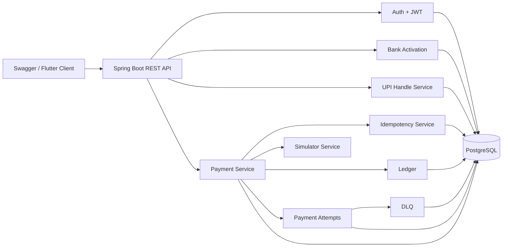

# SPay

**Secure | Swift | Safe**

SPay is a Spring Boot based UPI payment switch simulator built for the Build-A-Thon hackathon. It simulates a GPay-style payment journey without touching real money, real UPI rails, real bank APIs, real card networks, or real card storage.

The backend is the core of the project: user onboarding, mock bank activation, UPI handle creation, UPI payment, ledger entries, timeline tracking, idempotency, simulator-controlled provider outcomes, retry attempts, and DLQ visibility.

## What SPay Demonstrates

- A realistic UPI activation journey: register, login, discover bank, verify OTP, verify mock debit card, set UPI PIN, create UPI ID.
- A user-to-user UPI payment flow with sender/receiver validation, UPI PIN check, balance movement, ledger entries, and transaction timeline.
- Idempotency using `X-Idempotency-Key`, request hashing, stored response replay, and conflict detection.
- A configurable payment simulator that can force success, retryable failure, or non-retryable failure.
- Retry attempt recording and DLQ creation when retryable failures are exhausted.
- Admin-only simulator and DLQ APIs.
- Swagger-first demo flow for hackathon evaluation.

## Tech Stack

| Area | Choice |
| --- | --- |
| Backend | Spring Boot 4 |
| Language | Java 21 target |
| Database | PostgreSQL |
| ORM | Spring Data JPA / Hibernate |
| Security | Spring Security, JWT, BCrypt |
| API docs | Springdoc OpenAPI / Swagger UI |
| Mapping | MapStruct |
| Build | Maven wrapper |

Redis is used for UPI resolve caching, payment rate limiting, and sender-account distributed locking. A database-backed outbox table stores payment events in the same transaction as payment completion, then a scheduled publisher sends those events to Kafka and a consumer records processed events idempotently.

## Local Setup

Required:

- Java 21 or newer
- PostgreSQL running locally
- Redis running locally, if you want to demo cache, rate limiting, and distributed locking
- Kafka running locally, if you want to demo outbox publishing and idempotent consumption
- Database named `spay_db`
- Maven wrapper from this repository

Default database settings are in `src/main/resources/application.yaml`:

```yaml
spring:
  datasource:
    url: jdbc:postgresql://localhost:5432/spay_db
    username: postgres
    password: Root@123
```

Run the app on Windows PowerShell:

```powershell
$env:JAVA_HOME='C:\Users\Admin\.jdks\corretto-22.0.2'
.\mvnw.cmd spring-boot:run
```

Compile only:

```powershell
$env:JAVA_HOME='C:\Users\Admin\.jdks\corretto-22.0.2'
.\mvnw.cmd -DskipTests compile
```

Swagger UI:

```text
http://localhost:8080/swagger-ui.html
```

Actuator health:

```text
http://localhost:8080/actuator/health
```

## Core API Flow

### 1. Register And Login

```text
POST /api/auth/register
POST /api/auth/login
```

Login returns a JWT. Use Swagger `Authorize` with:

```text
Bearer <token>
```

### 2. Bank Activation

```text
GET  /api/banks
POST /api/banks/discovery/start
POST /api/banks/discovery/{sessionId}/verify-otp
POST /api/bank-accounts/discovery/{sessionId}/verify-debit-card
POST /api/bank-accounts/{bankAccountId}/upi-pin
GET  /api/bank-accounts/me
```

SPay returns a demo OTP in the discovery response for local testing. Mock debit-card fields are used only for verification and are not stored.

### 3. UPI Handle

```text
POST /api/upi/handles
GET  /api/upi/resolve/{upiId}
```

Example UPI ID:

```text
ammar@spay
```

### 4. UPI Payment

```text
POST /api/payments/upi
GET  /api/payments/{paymentId}
GET  /api/payments/{paymentId}/timeline
GET  /api/payments/{paymentId}/attempts
GET  /api/payments/history
```

Payment creation requires:

```text
X-Idempotency-Key: <unique-key-for-this-payment-attempt>
```

Example request:

```json
{
  "senderUpi": "sender@spay",
  "receiverUpi": "receiver@spay",
  "amountPaise": 50000,
  "upiPin": "1234",
  "note": "Dinner"
}
```

## Idempotency Design

SPay requires `X-Idempotency-Key` on payment creation. The client generates one unique key per payment attempt and reuses the same key only when retrying the same HTTP request after timeout/network failure.

The backend creates a request hash from:

```text
senderUpi + receiverUpi + amountPaise + note
```

The UPI PIN is intentionally excluded from the hash because it is sensitive authentication data.

Behavior:

| Case | Result |
| --- | --- |
| New key | Process payment and save response |
| Same key + same request hash | Return saved response, no second debit |
| Same key + different request hash | Return conflict |

Stored data:

- `idempotency_records.owner_user_id`
- `endpoint`
- `idempotency_key`
- `request_hash`
- `transaction_id`
- safe response JSON
- expiry timestamp

## Simulator, Retry, And DLQ

Admin can control payment provider behavior through:

```text
PUT /api/admin/simulator/rules
GET /api/admin/simulator/rules/active
GET /api/admin/dlq
```

Admin endpoints are protected by role:

```java
.requestMatchers("/api/admin/**").hasRole("ADMIN")
```

To make a demo user admin locally:

```sql
update app_users
set role = 'ADMIN'
where email = 'your-email@example.com';
```

Login again after this change, because the JWT contains the role at token creation time.

### Simulator Modes

```json
{
  "mode": "ALWAYS_SUCCESS",
  "maxAttempts": 3
}
```

| Mode | Meaning | Final Status |
| --- | --- | --- |
| `ALWAYS_SUCCESS` | Provider approves payment | `SUCCESS` |
| `ALWAYS_RETRYABLE_FAILURE` | Temporary provider timeout/down scenario | `DEAD_LETTERED` after max attempts |
| `ALWAYS_NON_RETRYABLE_FAILURE` | Provider permanently rejects payment | `FAILED` |

`maxAttempts` matters for retryable failure only.

### Retry And DLQ Flow

When simulator mode is `ALWAYS_RETRYABLE_FAILURE`:

```text
attempt 1 -> RETRYABLE_FAILURE
attempt 2 -> RETRYABLE_FAILURE
attempt 3 -> RETRYABLE_FAILURE
transaction -> DEAD_LETTERED
DLQ event -> OPEN
```

Storage:

| Table | Purpose |
| --- | --- |
| `payment_transactions` | Final transaction state |
| `payment_attempts` | Every simulator/retry execution |
| `dlq_events` | Failed payments that exhausted retry attempts |
| `payment_timeline_events` | Human-readable state changes |
| `ledger_entries` | Debit and credit records for successful money movement |

Money is moved only after simulator success. Retryable and non-retryable simulator failures do not debit the sender.

## Architecture

Design diagram exports:




## Entity Overview

Main entities:

- `AppUser`
- `BankDiscoverySession`
- `BankAccount`
- `UpiCredential`
- `UpiHandle`
- `PaymentTransaction`
- `LedgerEntry`
- `PaymentTimelineEvent`
- `IdempotencyRecord`
- `SimulatorRule`
- `PaymentAttempt`
- `DlqEvent`

ER diagram source:

```text
docs/er-diagram.mmd
```

Architecture diagram source:

```text
docs/architecture-diagram.mmd
```

## Demo Script

Use this as a 2 to 5 minute video script.

1. Open Swagger at `http://localhost:8080/swagger-ui.html`.
2. Register two users and login.
3. For each user, run bank discovery, verify OTP, verify mock debit card, set UPI PIN, and create UPI handles.
4. Set one user to `ADMIN` in DBeaver and login again.
5. Set simulator mode to `ALWAYS_SUCCESS`.
6. Make UPI payment with `X-Idempotency-Key`.
7. Show payment status `SUCCESS`, timeline, attempts, and balance effect.
8. Repeat the same payment request with the same idempotency key and show the same transaction response.
9. Change simulator mode to `ALWAYS_RETRYABLE_FAILURE`.
10. Make another payment with a new idempotency key.
11. Show status `DEAD_LETTERED`, three attempts, and the DLQ row.
12. Change simulator mode to `ALWAYS_NON_RETRYABLE_FAILURE`.
13. Make another payment and show status `FAILED` with one non-retryable attempt.
14. End on README/architecture diagram and explain that no real money, bank, card, or UPI rail is used.

## Security And Sensitive Data

SPay uses PCI-inspired controls for the demo, but it is not PCI DSS certified.

- No real card number, CVV, real bank credentials, or real UPI credentials are accepted.
- Passwords are stored with BCrypt.
- UPI PINs are stored with BCrypt.
- OTP is stored as a hash.
- Mock debit-card last-six and expiry are request-only values and are not persisted.
- Bank account stores an opaque account token and masked account number.
- JWT is required for protected APIs.
- Admin APIs require `ADMIN` role.
- UPI PIN is excluded from idempotency request hashes and response snapshots.

## Implemented Hackathon Requirements

| Requirement | Current implementation |
| --- | --- |
| Spring Boot backend | Spring Boot 4 modular backend |
| Database | PostgreSQL with JPA entities |
| Idempotency | `X-Idempotency-Key`, request hash, response replay |
| Retry handling | `PaymentAttempt` rows for retryable failures |
| Dead-letter handling | `DlqEvent` row after attempts exhausted |
| Caching | Redis cache for UPI resolve responses |
| Rate limiting | Redis fixed-window limiter for UPI payment attempts |
| Distributed locking | Redis sender-bank-account lock around debit/credit |
| Outbox pattern | `OutboxEvent` row written with payment success/failure/DLQ |
| Kafka | Scheduled outbox publisher sends payment events to Kafka |
| Idempotent consumer | Kafka consumer stores `ProcessedEvent` rows and skips duplicates |
| Clean failures | Business exceptions and validation responses |
| Swagger | Springdoc OpenAPI UI |
| Security | JWT, BCrypt, role-based admin APIs |
| Architecture docs | `docs/architecture.md`, Mermaid diagrams |

## Known Limitations

- Payment processing is synchronous for demo reliability.
- Retry attempts are simulated immediately in the same request. `nextRetryAt` is stored to show realistic backoff, but no background scheduler is currently required for the demo.
- Redis cache, rate limiting, and distributed locking are implemented with graceful fallback logging if Redis is unavailable locally.
- Outbox events are persisted to PostgreSQL and published to Kafka by a scheduler. The demo still keeps money movement synchronous so payment correctness is easy to verify live.
- Merchant QR flow is planned/scaffolded but not the primary tested demo path.
- Flutter is optional/polish; the backend and Swagger flow are the reliable judging path.

## Future Scope

- Redis caching for merchant QR lookup.
- Redis rate limiting for OTP, PIN, and UPI resolve APIs.
- PostgreSQL row locks in addition to Redis account locks for stronger multi-instance double-spend prevention.
- Async payment processing where Kafka consumer performs money movement instead of only consuming published outcome events.
- Admin DLQ retry/replay API.
- Merchant QR payment fully integrated into the same payment engine.
- Flutter polished demo app.
- Split bills, refunds, disputes, rewards, fraud scoring, and deployment.
