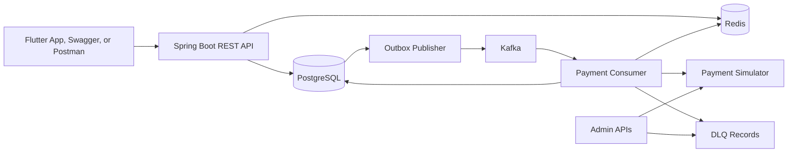

# SPay Product And Architecture Specification

Tagline: **Secure | Swift | Safe**

Status: design baseline before business implementation.

SPay is a GPay-inspired UPI payment switch simulator. It demonstrates how a real payment product behaves without connecting to a real bank, card network, NPCI, UPI rail, or real money. The product story is realistic onboarding plus production-style payment reliability.

## 1. What We Are Building

Three actors use SPay:

1. A consumer registers, activates a mock bank account, creates an SPay UPI ID, pays another user, pays a merchant, and views receipts.
2. A merchant creates a business profile, generates expiring SPay QR codes, receives simulated payments, and views received transactions.
3. An admin or hackathon judge changes simulator behavior, watches retry attempts, inspects dead-lettered payments, and replays a failed payment.

The winning story is not "we cloned every GPay screen." The story is "we built a small but believable payment system and made duplicate requests, concurrency, failures, retries, and events observable and safe."

## 2. Scope Decisions

### Must Ship

- Register and login with JWT authentication.
- Mock bank discovery using the registered phone number.
- Demo OTP verification.
- Demo debit-card verification using transient last-six and expiry values.
- Hashed UPI PIN setup and PIN lockout behavior.
- Unique UPI handle creation and resolution.
- User-to-user UPI payment.
- Merchant profile and expiring one-time merchant QR payment.
- Asynchronous payment lifecycle and polling.
- Bank-account balance plus append-only debit, credit, and reversal ledger entries.
- Transaction history, receipt, timeline, and processing-attempt history.
- Clean happy-path and unhappy-path API responses.
- Idempotency, transactional outbox, Kafka, retry, DLQ, Redis cache, Redis rate limiting, and distributed locking.
- PostgreSQL, Redis, Kafka, Kafka UI, and the application in Docker Compose.
- OpenAPI documentation and Swagger UI.
- Flutter app covering the complete demo path.
- README, ER diagram, architecture diagram, setup guide, decisions, and demo script.

### Ship Only After The Must List

- In-app admin Demo Lab for changing simulator rules.
- Actual camera scanning; a deterministic demo QR picker is enough for the judged demo.
- Merchant dashboard charts.
- Push notification simulation.
- Deployment to a cloud host.

### Future Scope

- Split bills.
- Real bank, UPI, OTP, card, KYC, or payment integrations.
- Refund and dispute workflow.
- Rewards and cashback.
- Contacts synchronization.
- Recurring mandates.
- Full fraud-scoring engine.
- Multi-currency support.

## 3. Exact User Journey

### Consumer Activation

1. User registers with full name, email, phone number, and password.
2. User logs in and receives a JWT access token.
3. App shows supported demo banks: HDFC, SBI, ICICI, Axis, and Kotak.
4. User chooses a bank and starts discovery.
5. Backend creates a short-lived discovery session and returns one masked candidate account.
6. App shows the demo OTP in a clearly labeled development-only area.
7. User verifies the OTP.
8. User enters mock debit-card last six digits and expiry. The backend validates these values in memory and never stores them.
9. The mock bank account becomes `VERIFIED` and receives a configured demo balance.
10. User creates a 4 or 6 digit UPI PIN. Only a BCrypt hash is stored.
11. User chooses an available handle such as `ammar@spay`.
12. The home screen now enables Send Money and Scan and Pay.

### User-To-User Payment

1. Sender enters receiver UPI ID.
2. App resolves and displays the receiver name and masked destination bank.
3. Sender enters amount and optional note.
4. App creates a new idempotency key and submits the payment with the UPI PIN.
5. API validates authentication, rate limit, PIN, receiver, amount, account state, and idempotency.
6. API saves `INITIATED` payment, first timeline entry, idempotency record, and outbox event in one PostgreSQL transaction.
7. API returns `202 Accepted` with transaction ID.
8. Outbox publisher sends `PaymentRequested` to Kafka.
9. Kafka consumer obtains distributed account locks and database row locks.
10. Consumer invokes the simulator, creates an attempt record, posts ledger entries, and updates status.
11. Flutter polls transaction status and shows processing, success, failure, pending, reversed, or dead-lettered UI.
12. The receipt displays reference ID, participants, amount, note, status, and timeline.

### Merchant Payment

1. A verified user creates one merchant profile and links a verified settlement account.
2. Merchant generates a one-time dynamic QR with optional fixed amount, note, and short expiry.
3. QR payload contains an SPay reference and signature. It never invokes a real UPI app.
4. Consumer scans the QR or selects a built-in demo QR.
5. Backend resolves the QR and verifies signature, merchant state, and expiry.
6. Consumer confirms amount, enters UPI PIN, and submits with an idempotency key.
7. The same asynchronous payment engine debits the consumer account, credits the merchant settlement account, and consumes the QR exactly once.
8. Consumer receives a receipt and merchant sees the received payment.

### Admin And Judge Journey

1. Admin changes simulator mode to forced success, forced timeout, provider down, or debit-success-credit-failed.
2. Admin initiates or asks the consumer to initiate a payment.
3. Admin views payment attempts, backoff times, timeline changes, and final DLQ entry.
4. Admin restores simulator mode and replays the DLQ item.
5. The replay continues safely without a second debit because the consumer and ledger are idempotent.

## 4. High-Level Architecture



The application remains a modular monolith. All modules run in one Spring Boot deployment, which is achievable for the hackathon, while PostgreSQL, Redis, and Kafka demonstrate realistic infrastructure boundaries.

## 5. Module Ownership

| Module | Responsibility |
| --- | --- |
| `auth` | Register, login, JWT creation, password verification |
| `user` | User profile and account status |
| `bank` | Bank catalog, discovery session, OTP, debit-card verification, mock bank account, UPI PIN |
| `upi` | Create and resolve UPI handles |
| `merchant` | Merchant profile, dynamic QR generation and resolution |
| `payment` | Payment commands, lifecycle, idempotency, attempts, timeline, retries, DLQ |
| `ledger` | Append-only debit, credit, and reversal entries |
| `simulator` | Configurable external-provider outcomes |
| `outbox` | Outbox persistence, Kafka publication, Kafka consumption deduplication |
| `admin` | Simulator control, DLQ inspection, replay, operational summaries |
| `common` | Errors, API envelope, security, OpenAPI, Redis utilities, rate limiting, locking |

All domain services use an interface in `service` and an implementation in `service.impl`.

## 6. Hackathon Requirements Mapped To Features

| Requirement | SPay implementation | Demo proof |
| --- | --- | --- |
| Spring Boot core | Spring Boot 4 modular monolith | Start app and open Actuator/Swagger |
| Database | PostgreSQL entities and migrations | Show transaction, ledger, timeline, outbox tables |
| Idempotency | `X-Idempotency-Key`, request hash, stored response, unique constraint | Repeat request and show same transaction with one debit |
| Outbox pattern | Payment and outbox saved in one DB transaction | Show pending then published outbox row |
| Kafka | Payment requested event plus idempotent consumer | Show topic and consumer processing in Kafka UI |
| Retry | Retryable attempt records with configurable backoff | Force timeout and show attempts 1, 2, and 3 |
| Dead letter | Exhausted retry creates DLQ record and admin replay | Show DLQ API then replay it |
| Caching | UPI resolution and merchant QR lookup cached in Redis | Resolve twice and show cache hit metric/log |
| Rate limiting | Redis limits OTP, PIN, UPI resolution, and payment attempts | Send rapid requests and receive HTTP 429 |
| Distributed locking | Redis account lock plus PostgreSQL row lock | Fire concurrent payments and prevent negative balance |
| External services | PostgreSQL, Redis, Kafka, Kafka UI | Docker Compose services running |
| Frontend | Flutter consumer and merchant demo journeys | Complete payment from app |

## 7. Payment State Machine

```text
INITIATED -> VALIDATING -> PROCESSING -> SUCCESS
                       |             -> PENDING -> PROCESSING
                       |             -> REVERSED
                       |             -> FAILED
                       |             -> DEAD_LETTERED
                       -> FAILED
```

- `INITIATED`: API accepted and persisted the command.
- `VALIDATING`: consumer checks accounts, QR, limits, and current balance.
- `PROCESSING`: simulator and ledger operations are running.
- `PENDING`: a retryable timeout or provider problem occurred and a retry is scheduled.
- `SUCCESS`: debit and credit completed exactly once.
- `FAILED`: a final non-retryable error occurred.
- `REVERSED`: debit occurred, credit failed, and compensation returned the amount to sender.
- `DEAD_LETTERED`: retry limit was exhausted or compensation could not complete.

Terminal states are `SUCCESS`, `FAILED`, `REVERSED`, and `DEAD_LETTERED`.

## 8. Reliability Design

### Idempotency

- Required for UPI and merchant payment creation.
- Unique key: authenticated user ID + endpoint + idempotency key.
- Request fingerprint includes payment type, receiver or QR reference, amount, and note. It excludes the UPI PIN.
- Same key and same fingerprint returns the stored response and transaction ID.
- Same key and different fingerprint returns HTTP 409.
- The Flutter app creates one UUID per user confirmation and reuses it only when retrying the same HTTP request.

### Outbox And Kafka

- The payment, timeline event, idempotency record, and outbox event are inserted in one database transaction.
- A scheduled outbox publisher claims pending rows in batches and publishes them to Kafka.
- Publication updates outbox status and attempts.
- Kafka event ID is stable across publisher retries.
- Consumer writes a `PROCESSED_EVENT` record with a unique event ID and consumer name.
- Duplicate Kafka delivery returns without reprocessing money movement.

### Retry And DLQ

- Retry only `BANK_TIMEOUT`, `PROVIDER_DOWN`, `LOCK_NOT_ACQUIRED`, and temporary infrastructure errors.
- Never retry invalid UPI, wrong PIN, insufficient balance, frozen account, invalid amount, expired QR, or same-sender-and-receiver.
- Demo backoff: 2 seconds, 5 seconds, then 15 seconds. Keep it configurable.
- Every execution writes a `PAYMENT_ATTEMPT` record.
- Exhaustion changes payment to `DEAD_LETTERED` and creates a DLQ record.
- Admin replay changes DLQ status to replaying and emits a new event for the same transaction. It never creates a new payment.

### Caching

- UPI resolution: key `spay:upi:{upiId}`, TTL 10 minutes.
- Merchant QR resolution: key `spay:qr:{qrReference}`, TTL no longer than QR expiry.
- Supported bank catalog: key `spay:banks`, TTL 24 hours.
- Cache entries store public lookup data only. Password, OTP, debit-card input, and UPI PIN never enter Redis.
- Entity changes evict matching cache keys.

### Rate Limiting

- Login: 10 attempts per 15 minutes per IP and normalized email.
- OTP verification: 5 attempts per 10 minutes per session.
- UPI PIN verification: 5 attempts per 15 minutes per user; three wrong PINs also lock the credential.
- UPI resolution: 30 requests per minute per user.
- Payment creation: 5 requests per minute per user.
- Return HTTP 429 with error code, retry-after seconds, and request ID.

### Locking And Double-Spend Prevention

- Obtain Redis locks for sender and receiver account IDs in sorted order.
- Use a short lease and fail safely if locks cannot be acquired.
- Inside PostgreSQL, lock account rows before checking balance and posting entries.
- Use a version column for optimistic conflict detection outside the payment critical section.
- Add a unique ledger deduplication key so a retried consumer cannot post the same debit or credit twice.
- Redis improves coordination; PostgreSQL constraints and row locks remain the correctness authority.

## 9. Simulator Rules

| Mode | Result |
| --- | --- |
| `NORMAL` | Deterministic weighted success, pending, and failure results |
| `FORCE_SUCCESS` | Payment succeeds |
| `FORCE_FAILURE` | Final non-retryable provider rejection |
| `FORCE_TIMEOUT` | Retryable timeout until max attempts |
| `PROVIDER_DOWN` | Retryable provider unavailable result |
| `SLOW_SUCCESS` | Delayed success for processing UI |
| `DEBIT_SUCCESS_CREDIT_FAILED` | Demonstrates compensating reversal |

Production-like randomness must be seedable. The demo can force an exact mode so the video never depends on chance.

## 10. Failure Contract

| Error code | HTTP or final status | Retryable |
| --- | --- | --- |
| `INVALID_CREDENTIALS` | 401 | No |
| `OTP_INVALID` | 400 | No |
| `OTP_EXPIRED` | 410 | No |
| `DEBIT_CARD_VERIFICATION_FAILED` | 400 | No |
| `UPI_PIN_INVALID` | 400 | No |
| `UPI_PIN_LOCKED` | 423 | No |
| `UPI_NOT_FOUND` | 404 | No |
| `SENDER_RECEIVER_SAME` | 400 | No |
| `INSUFFICIENT_BALANCE` | `FAILED` | No |
| `AMOUNT_LIMIT_EXCEEDED` | 400 | No |
| `BANK_ACCOUNT_FROZEN` | `FAILED` | No |
| `MERCHANT_INACTIVE` | 400 | No |
| `MERCHANT_QR_EXPIRED` | 410 | No |
| `IDEMPOTENCY_CONFLICT` | 409 | No |
| `RATE_LIMIT_EXCEEDED` | 429 | After retry-after |
| `LOCK_NOT_ACQUIRED` | `PENDING` | Yes |
| `BANK_TIMEOUT` | `PENDING` | Yes |
| `PROVIDER_DOWN` | `PENDING` | Yes |
| `CREDIT_FAILED` | `REVERSED` or `DEAD_LETTERED` | Compensation |

Every error response contains `timestamp`, `status`, `code`, `message`, `path`, `requestId`, and field validation errors when relevant.

## 11. Security And Sensitive Data

- SPay accepts only mock data and must display that fact in onboarding and README.
- Password and UPI PIN use separate BCrypt hashes.
- OTP is stored as a short-lived hash, never plain text in the database.
- Mock debit-card last six and expiry are request-only values and are never persisted, cached, placed in events, or logged.
- Bank account stores an opaque token and masked number only.
- JWT secret and infrastructure credentials come from environment variables.
- Logs must redact `password`, `otp`, `upiPin`, `lastSix`, authorization headers, and cookies.
- API uses DTO validation, authenticated ownership checks, and role checks for admin endpoints.
- Documentation must say "PCI-inspired controls" and must not claim PCI DSS certification.
- No endpoint may accept a full PAN, CVV, real account number, or real UPI credential.

## 12. API Surface

### Authentication And User

```text
POST /api/auth/register
POST /api/auth/login
GET  /api/users/me
```

### Bank Activation

```text
GET  /api/banks
POST /api/bank-discovery/start
POST /api/bank-discovery/{sessionId}/verify-otp
POST /api/bank-accounts/{accountId}/verify-debit-card
POST /api/bank-accounts/{accountId}/upi-pin
GET  /api/bank-accounts/me
```

### UPI

```text
POST /api/upi/handles
GET  /api/upi/handles/me
GET  /api/upi/resolve/{upiId}
```

### Merchant

```text
POST /api/merchants
GET  /api/merchants/me
POST /api/merchants/{merchantId}/qrs
GET  /api/merchant-qrs/{qrReference}
GET  /api/merchants/{merchantId}/payments
```

### Payment

```text
POST /api/payments/upi
POST /api/payments/merchant
GET  /api/payments/{transactionId}
GET  /api/payments/{transactionId}/timeline
GET  /api/payments/{transactionId}/attempts
GET  /api/payments/history
```

Payment creation requires `X-Idempotency-Key` and returns HTTP 202 for a newly accepted asynchronous request.

### Admin

```text
GET  /api/admin/simulator/rules
PUT  /api/admin/simulator/rules
GET  /api/admin/dlq
GET  /api/admin/dlq/{id}
POST /api/admin/dlq/{id}/retry
GET  /api/admin/outbox
```

## 13. Deliverables

- Runnable Spring Boot backend.
- Runnable Flutter app.
- `docker-compose.yml` for PostgreSQL, Redis, Kafka, and Kafka UI.
- `.env.example` with no real secrets.
- Swagger UI at `http://localhost:8080/swagger-ui.html` or the path confirmed by the installed springdoc version.
- Detailed `README.md` with setup, architecture, data safety, decisions, API examples, and known limitations.
- `docs/er-diagram.mmd`.
- Architecture diagram and payment sequence diagram.
- Automated tests for core payment correctness and reliability patterns.
- API collection or reproducible curl examples.
- Two-to-five minute demo script and recorded video.
- Deployment only after the local demo is reliable.

## 14. Definition Of Complete

SPay is complete when a fresh machine can start infrastructure, run the backend, open Swagger, activate two demo users, complete UPI and merchant payments, repeat an idempotent request without double debit, force a timeout into retries and DLQ, replay it safely, and complete the same normal payment journey through Flutter using documented steps.
