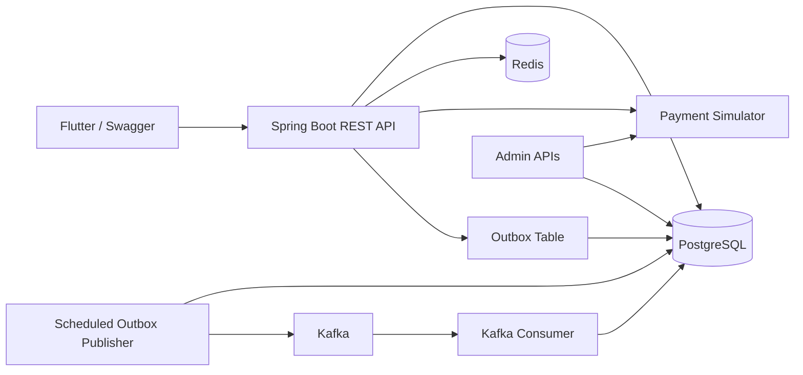

# SPay Architecture

Tagline: **Secure | Swift | Safe**

SPay is a Spring Boot UPI payment switch simulator. It does not connect to real banks, NPCI, card networks, OTP providers, or real money. The goal is to demonstrate realistic payment-system backend patterns in a small hackathon MVP.

## Current Demo Scope

Implemented and demo-ready:

- Register and login with JWT.
- Mock bank discovery.
- Demo OTP verification.
- Mock debit-card verification without storing card input.
- BCrypt password and UPI PIN hashing.
- UPI handle creation and resolve.
- User-to-user UPI payment.
- Ledger entries and payment timeline.
- Transaction history and details.
- Idempotency with `X-Idempotency-Key`.
- Simulator-driven success, retryable failure, and non-retryable failure.
- Retry attempts and DLQ record creation.
- Redis UPI resolve cache.
- Redis payment rate limiting.
- Redis sender-bank-account distributed lock.
- PostgreSQL transactional outbox rows.
- Scheduled Kafka outbox publisher.
- Kafka consumer with processed-event deduplication.
- Admin APIs for simulator, DLQ, outbox, and processed events.
- Swagger UI.
- Flutter polished demo UI for user-to-user transfer.

Not primary demo scope:

- Merchant QR payment.
- Full async money movement inside Kafka consumer.
- Real bank, UPI, OTP, debit-card, or payment integration.
- Cloud deployment.

## High-Level Architecture



The app remains a modular monolith, which keeps the hackathon build achievable while still showing production-style boundaries through PostgreSQL, Redis, Kafka, and Kafka UI.

## Payment Flow

1. Client sends `POST /api/payments/upi` with `X-Idempotency-Key`.
2. Backend checks whether the same idempotency key and request hash already has a saved response.
3. Redis rate limiter checks payment spam for the current user.
4. Sender and receiver UPI handles are resolved.
5. Redis lock is acquired for the sender bank account.
6. Backend validates sender ownership, UPI PIN, verified accounts, same-account protection, and balance.
7. Simulator decides outcome.
8. Success path debits sender, credits receiver, writes ledger entries, updates timeline, and marks payment `SUCCESS`.
9. Retryable failure path writes attempts and moves payment to `DEAD_LETTERED` after max attempts.
10. Non-retryable failure path marks payment `FAILED`.
11. Outbox event is written for success, failure, or DLQ result.
12. Idempotency response is saved.
13. Redis lock is released.
14. Scheduled publisher sends outbox event to Kafka.
15. Kafka consumer stores a processed-event row and skips duplicates.

## Requirement Mapping

| Hackathon requirement | SPay implementation | Demo proof |
| --- | --- | --- |
| Spring Boot backend | Spring Boot 4 modular backend | Run app and open Swagger |
| Database | PostgreSQL JPA entities | Show users, accounts, transactions, ledger, timeline |
| Idempotency | Key + request hash + stored response | Repeat same payment key and show no double debit |
| Retry | `PaymentAttempt` records | Force retryable simulator mode |
| DLQ | `DlqEvent` after exhausted attempts | `GET /api/admin/dlq` |
| Caching | Redis cache for UPI resolve | Resolve same UPI twice |
| Rate limiting | Redis fixed-window limiter on payment attempts | Send more than 5 new payments in 1 minute |
| Distributed locking | Redis sender account lock | Explain/attempt concurrent debit prevention |
| Outbox | `OutboxEvent` saved after payment outcome | `GET /api/admin/outbox` |
| Kafka | Scheduled publisher and consumer | Outbox becomes `PUBLISHED`, processed event appears |
| Swagger | Springdoc OpenAPI | `http://localhost:8080/swagger-ui.html` |
| Frontend | Flutter demo UI | Register, activate UPI, pay user |

## Key APIs

Auth:

```text
POST /api/auth/register
POST /api/auth/login
```

Bank activation:

```text
GET  /api/banks
POST /api/banks/discovery/start
POST /api/banks/discovery/{sessionId}/verify-otp
POST /api/bank-accounts/discovery/{sessionId}/verify-debit-card
POST /api/bank-accounts/{bankAccountId}/upi-pin
GET  /api/bank-accounts/me
```

UPI:

```text
POST /api/upi/handles
GET  /api/upi/resolve/{upiId}
```

Payments:

```text
POST /api/payments/upi
GET  /api/payments/{paymentId}
GET  /api/payments/{paymentId}/timeline
GET  /api/payments/{paymentId}/attempts
GET  /api/payments/history
```

Admin:

```text
PUT /api/admin/simulator/rules
GET /api/admin/simulator/rules/active
GET /api/admin/dlq
GET /api/admin/outbox
GET /api/admin/processed-events
```

## Sensitive Data Rules

- Passwords are stored as BCrypt hashes.
- UPI PIN is stored as a BCrypt hash.
- OTP is stored/verified as a hash in backend flow.
- Mock debit-card last six and expiry are transient request values and are not persisted.
- Redis cache stores public UPI lookup response data only.
- Kafka events do not contain passwords, OTP, debit-card input, or UPI PIN.

## Demo Notes

For the strongest demo:

1. Start PostgreSQL, Redis, Kafka, and Kafka UI.
2. Run the Spring Boot app.
3. Open Swagger.
4. Register two users and activate bank/UPI for both.
5. Make a successful payment.
6. Repeat the same idempotency key.
7. Force retryable simulator mode and show DLQ.
8. Show `/api/admin/outbox` and `/api/admin/processed-events`.
9. Show Flutter as the polished user-facing layer.
